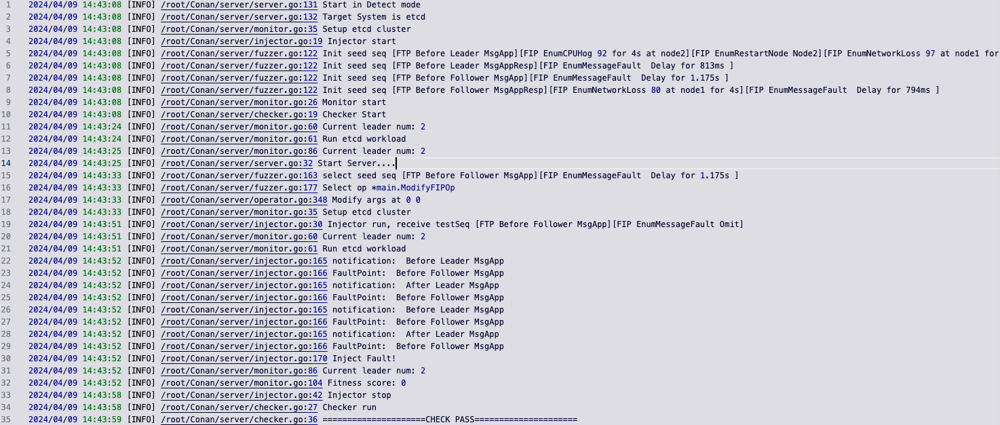
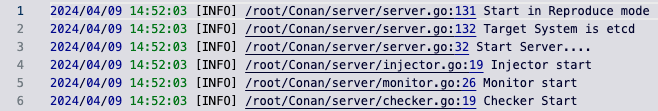

# Conan: Uncover Consensus Issues in Distributed Databases Using Fuzzing-driven Fault Injection
Conan is a testing framework for detecting consensus issues in distributed databases by fault injection. 


* We observe that state changes improve the efficiency of generating fault sequences. Hence, Conan monitors state changes as feedback to guide fuzzing for the effective generation of fault sequences. 
* We observe that solely using coarse-grained faults is not sufficient for issue detection. Hence, Conan combines fine-grained and coarse-grained faults to form hybrid fault sequences to uncover consensus issues. 

## Issues Uncovered by Conan
We appied Conan to 3 widely used distributed databases, including etcd, rqlite and openGauss. Conan successfully uncovers 7  previous-unknown issues and 6 of them have been confirmed by developers. 
| Issue ID | Description | 
|-----|-----|
| [etcd-17332](https://github.com/etcd-io/etcd/issues/17332) | Inconsistent behaviors between server and client. | 
| [rqlite-1629](https://github.com/rqlite/rqlite/pull/1629) | Duplicate data insertion. | 
| [rqlite-1633](https://github.com/rqlite/rqlite/pull/1633) | Inappropriate error messages.  | 
| [rqlite-1712](https://github.com/rqlite/rqlite/issues/1712) | Unexpected election. | 
| [openGauss-I8I19W](https://gitee.com/opengauss/openGauss-server/issues/I8I19W) | Data inconsistency between nodes. | 
| [openGauss-I8H1YQ](https://gitee.com/opengauss/openGauss-server/issues/I8H1YQ) | No Leader. | 
| [openGauss-I8MGB4](https://gitee.com/opengauss/openGauss-server/issues/I8MGB4) | No Leader. |

## Require
```
Docker
docker-compose 2.6
go 1.21.0
python 3.6
```

## Folder Structure
```
Conan
├── client # Conan client api
├── config # Configuration required to start Conan server 
├── images
├── init.sh # Initialize directory, pull docker images and install tools
├── logs # Conan server log
├── README.md
├── reproduce # Notify Conan server to start processing client's request
├── run.sh # Run Conan server
├── scripts # ChaosBlade tool
├── sequences # Fault sequences for reproducing issues. 
├── server # Conan server code
└── systems # Target system's necessary artifacts
    ├── etcd
    │   ├── docker-compose.yaml 
    │   ├── etcdctl
    │   ├── fault
    │   ├── findLeader.sh
    │   ├── raft
    │   ├── setup.py
    │   ├── setup.sh
    │   └── workload
    ...
```

## Getting Started
### Initial directory, pull docker images, build conan server
```
./init.sh
```
### Run conan server
```
# ./run.sh system mode 
```
#### Detect mode
```
./run.sh etcd Detect
```



#### Reproduce mode
* Start Conan server
```
./run.sh etcd Reproduce
```

* Setup cluster
```
docker-compose -f ./systems/etcd/docker-compose.yaml up
```
* Notify server to process client's request
```
./reproduce/reproduce ./sequences/rqlite-1712.json
```
* Run workload to trigger fault injection
```
rqlite -H 172.16.237.100 -p 2379
Welcome to the rqlite CLI.
Enter ".help" for usage hints.
Connected to http://172.16.237.100:2379 running version 8
172.16.237.100:2379> insert into t values(1)
172.16.237.100:2379> insert into t values(1)
```

* Bug is triggered

```
2024/04/09 20:21:34 [INFO] /root/Conan/server/server.go:131 Start in Reproduce mode
2024/04/09 20:21:34 [INFO] /root/Conan/server/server.go:132 Target System is rqlite
2024/04/09 20:21:34 [INFO] /root/Conan/server/server.go:32 Start Server....
2024/04/09 20:21:34 [INFO] /root/Conan/server/checker.go:19 Checker start
2024/04/09 20:21:34 [INFO] /root/Conan/server/monitor.go:26 Monitor start
2024/04/09 20:21:34 [INFO] /root/Conan/server/injector.go:19 Injector start
2024/04/09 20:22:30 [INFO] /root/Conan/server/injector.go:69 reproduce seq: &[{MsgApp Leader Before EnumMessageFault false false true 0 -4} {MsgApp Leader Before EnumMessageFault false false fasle 0 0} {MsgApp Leader Before EnumMessageFault false false fasle 0 0} {MsgApp Leader Before EnumMessageFault false false fasle 0 0} {MsgApp Leader Before EnumRestartNode 2,EnumMessageFault false false false 0 0}]
2024/04/09 20:22:30 [INFO] /root/Conan/server/injector.go:145 Reproduce seq [FTP Before Leader MsgApp][FIP EnumMessageFault  Modify term -4 ][FTP Before Leader MsgApp][FIP EnumMessageFault  Modify term 0 ][FTP Before Leader MsgApp][FIP EnumMessageFault  Modify term 0 ][FTP Before Leader MsgApp][FIP EnumMessageFault  Modify term 0 ][FTP Before Leader MsgApp][FIP EnumRestartNode Node2][FIP EnumMessageFault ]
2024/04/09 20:22:30 [INFO] /root/Conan/server/coordinator.go:93 Start Reproduce &{0xc000028300 /root/Conan/sequences/rqlite-1712.json}
2024/04/09 20:22:33 [INFO] /root/Conan/server/injector.go:171 Inject Fault!
2024/04/09 20:22:33 [INFO] /root/Conan/server/types.go:61 Inject EnumMessageFault  Modify term -4 
2024/04/09 20:22:34 [INFO] /root/Conan/server/action.go:119 New term is 18446744073709551615
2024/04/09 20:23:07 [INFO] /root/Conan/server/injector.go:171 Inject Fault!
2024/04/09 20:23:07 [INFO] /root/Conan/server/types.go:61 Inject EnumRestartNode Node2
2024/04/09 20:23:07 [INFO] /root/Conan/server/types.go:61 Inject EnumMessageFault 
2024/04/09 20:23:09 [INFO] /root/Conan/server/action.go:184 Restart Node2

```

### Support new target system
1. Instrumentation

Find fault trigger points in the source code and instrument the Conan client. 
Conan client has supported Golang, C, Rust and Java.

2. Prepare necessary scripts 
* Create a directory `systems/new_system`
* Define how to setup the target cluster in `new_system/setup.py` and `new_system/docker-compose.yaml`
* Define workload in `new_system/workload/workload.py`
* Define oracle in `new_system/workload/check.py`
* Define how to find leader for monitor in `new_system/findLeader.sh`
* Modify config to inject fault scenario in `new_system/fault`
    * cpu_hog.sh
    * network_delay.sh
    * network_loss.sh
    * restart_node.sh

3. Create Configuration file in `config/new_system.json`

```
{
  "mode": "Detect/Reproduce",
  "system": "new_system",
  "interval": # Must be longer than your system deployment duration
}
```

4. Run

```
./run.sh new_system Detect/Reproduce
```


