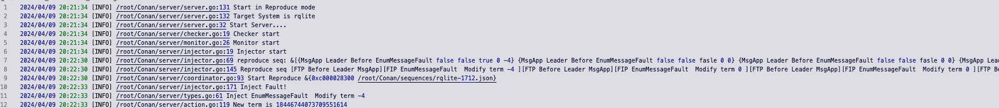
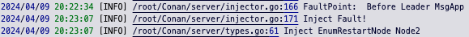

# Conan: Detect Consensus Issues in Distributed Databases using Multi-Feedback Fuzzing with Hybrid Fault Sequences
Conan is a testing framework for detecting consensus issues in distributed databases by fault injection. 

* We observe that solely using coarse-grained faults is not sufficient for bug detection. Hence, Conan combines fine-grained and coarse-grained faults to form fault sequence to uncover consensus issues. 
* We observe that runtime metrics improve the efficiency of generating fault sequences. Hence, Conan monitors runtime metrics as feedback to guide fuzzing for the effective generation of fault sequences. 

## Bug Detected by Conan
We appied Conan to 3 widely used distributed databases, including etcd, rqlite and openGauss. Conan successfully detects 8 consensus issues in these real-world databases, 6 of which are previous-unknown issues and 5 of them have been confirmed by developers. 
| Bug ID | Description | 
|-----|-----|
| [etcd-17332](https://github.com/etcd-io/etcd/issues/17332) | Inconsistent behaviors between server and client. | 
| [rqlite-1629](https://github.com/rqlite/rqlite/pull/1629) | Duplicate data insertion. | 
| [rqlite-1633](https://github.com/rqlite/rqlite/pull/1633) | Inappropriate error messages.  | 
| [rqlite-1712](https://github.com/rqlite/rqlite/issues/1712) | Unexpected election. | 
| [openGauss-I8I19W](https://gitee.com/opengauss/openGauss-server/issues/I8I19W) | Data inconsistency between nodes. | 
| [openGauss-I8H1YQ](https://gitee.com/opengauss/openGauss-server/issues/I8H1YQ) | No Leader. | 
| [openGauss-I8MGB4](https://gitee.com/opengauss/openGauss-server/issues/I8MGB4) | No Leader. |

## Require
```
Docker
docker-compose 2.6
go 1.21.0
python 3.6
```

## Directory Structure
```
Conan
├── client # Conan client api
├── config # Configuration required to start Conan server 
├── images
├── init.sh # Initialize directory, pull docker images and install tools
├── logs # Conan server log
├── README.md
├── reproduce # Notify Conan server to start processing client's request
├── run.sh # Run Conan server
├── scripts # ChaosBlade tool
├── sequences # Fault sequences for reproducing issues. 
├── server # Conan server code
└── systems # Target system's necessary artifacts
    ├── etcd
    │   ├── docker-compose.yaml 
    │   ├── etcdctl
    │   ├── fault
    │   ├── findLeader.sh
    │   ├── raft
    │   ├── setup.py
    │   ├── setup.sh
    │   └── workload
    ...
```

## Getting Started
### Initial directory, pull docker images, complie conan server
```
./init.sh
```
### Run conan server
```
# ./run.sh system mode 
```
#### Detect mode
```
./run.sh etcd Detect
```


#### Reproduce mode
* Start Conan server
```
./run.sh etcd Reproduce
```

* Setup cluster
```
docker-compose -f ./systems/etcd/docker-compose.yaml up
```
* Notify server to process client's request
```
./reproduce/reproduce ./sequences/rqlite-1712.json
```
* Run workload to trigger fault injection
```
rqlite -H 172.16.237.100 -p 2379
Welcome to the rqlite CLI.
Enter ".help" for usage hints.
Connected to http://172.16.237.100:2379 running version 8
172.16.237.100:2379> insert into t values(1)
172.16.237.100:2379> insert into t values(1)
```

* Bug is triggered




### Support new target system


